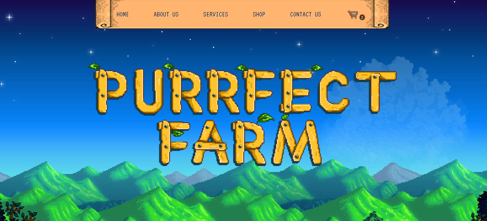
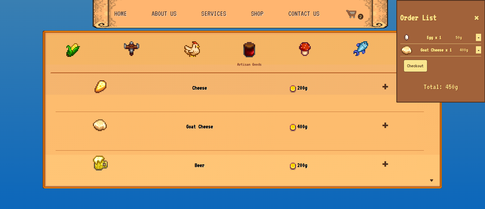

# Purrfect Farm

**Purrfect Farm** is a small, interactive farm shop website inspired by Stardew Valley. This project is built with plain **HTML, CSS, and JavaScript**, and simulates a real farmer's shop where you can browse, filter, and explore farm products and jobs.

---

## Project Overview

- You are the farmer and can showcase your products like vegetables, fruits, or animal products.  
- Users can browse products and filter them by type.  
- Job listings are displayed to simulate farm work opportunities.  
- Simple, lightweight, and fully hardcoded — ideal for learning HTML, CSS, and basic JavaScript.

---

## Features

- **Product Listing**: Displays all products from the game with filtering options.  
- **Job Listings**: Shows available farm jobs (hardcoded).  
- **Interactive UI**: Filter products by category.  
- **Stardew Valley Inspired**: The site’s theme and layout are inspired by the in-game farm shop experience.  

---

## How to Use

1. **Open the site**  
   - Simply open `index.html` in your browser.  

2. **Browse Products**  
   - Scroll through the list of farm products.  

3. **Filter Products**  
   - Use the filter buttons to view products by type (e.g., crops, animal products).  

4. **Explore Jobs**  
   - Check the job listings section to see available farm work.

---

## Screenshots

